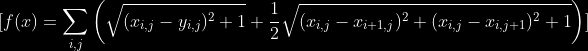

# Image Denoising

This repository provides two different approaches to image denoising:

1. **Optimization-based Denoising** (using gradient descent and BFGS)  

This part implements two optimization algorithms designed to minimize an energy function used in image processing. The energy function is defined as




2. **Wavelet-based Denoising** (using Haar wavelet transform and shrinkage)

Below is an overview of the project structure, its contents, and usage instructions.

---

## Project Structure

The repository is organized into two main directories to separate the optimization methods based on their order:


### `optimization/`

- **`bfgs.py`** & **`gradient_descent.py`**: Implement iterative optimization algorithms (BFGS and plain gradient descent) to solve a denoising problem formulated as minimizing an energy (cost) function.  
- **`plot.py`**: Helper script for visualizing results
- **`utils.py`**: Shared utility functions like the fundtion and the gradient of the function.

### `wavelet/`

- **`transform.py`**: Implements a 2D Haar wavelet transform (and inverse) with optional wavelet shrinkage methods (e.g., hard, soft, garrote).  
- **`plot.py`**: Helper script for plotting wavelet transform 
- **`utils.py`**: Helper functions such as resizing an image to a width that is a power of 2.

---

## Installation & Requirements

1. **Clone or Download:**  
   ```bash
   git clone https://github.com/zehe2000/image_denoising.git
   cd image-denoising
